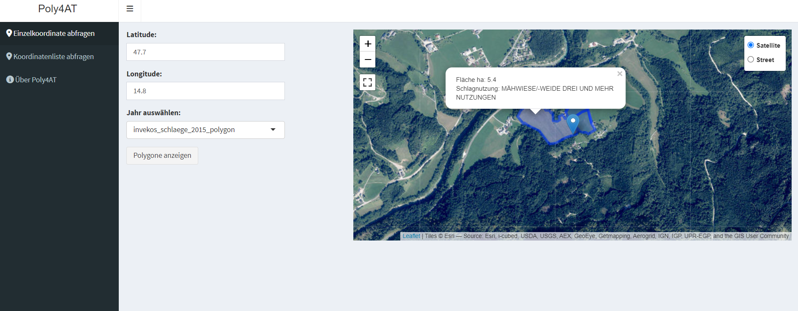

<!-- README.md is generated from README.Rmd. Please edit that file -->

```{r, include = FALSE}
knitr::opts_chunk$set(
  collapse = TRUE,
  comment = "#>",
  fig.path = "man/figures/README-",
  out.width = "100%"
)
```

# Poly4AT

<!-- badges: start -->
[](https://github.com/farmse988/Poly4AT/actions/workflows/R-CMD-check.yaml)
<!-- badges: end -->

The goal of Poly4AT is to access the [INVEKOS API](https://gis.lfrz.gv.at/api/geodata/i009501/ogc/features/v1/) for polygons.

## Installation

Install the following packages if they are not already installed.
```r

# install.packages(c("shiny", "sf", "leaflet", "geojsonsf", "httr", "jsonlite", "shinydashboard", "DT", "leaflet.extras"))
```


You can install the development version of Poly4AT from [GitHub](https://github.com/farmse988/Poly4AT.git) with:

``` r
# install.packages("devtools")
devtools::install_github("farmse988/Poly4AT")
```

You can install Poly4AT via CRAN

``` r
# install.packages("Poly4AT")
```

## Usage

### Loading the Package
First, load the Poly4AT package:

```{r, message=FALSE, results='hide', warning=FALSE }
library(Poly4AT)
```


### Start the Shiny Application
To start the Shiny application, simply run:

```{r, message=FALSE, results='hide', warning=FALSE }
poly4AT_processor()
```


## Example: Entering a Single Coordinate

You can enter a single coordinate within the borders of Austria:




## Example: Uploading Multiple Coordinates
You can upload multiple coordinates to the server and request polygons:


## Citation:


```{r }
citation("Poly4AT")
```


## Citation for API Data


AMA. (year of request). OGC Features API [API].requested on 1 October 2024, from https://gis.lfrz.gv.at/ogcapi009501/ogc/features/api
                        
## Language
The user interface (UI) of Shiny is in German, while the documentation and examples are in English. This ensures a user-friendly experience for German-speaking users and at the same time comprehensive information for international users.
