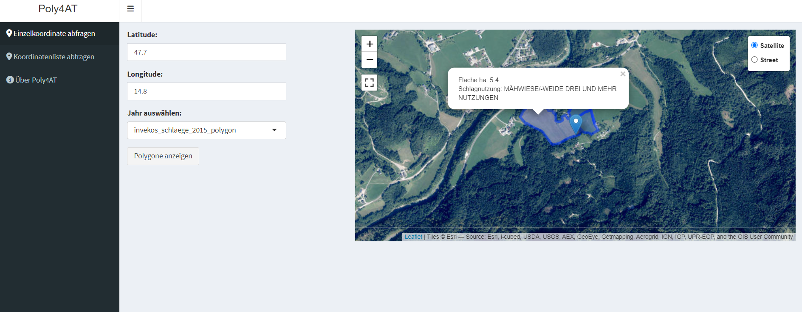

<!-- README.md is generated from README.Rmd. Please edit that file -->

# Poly4AT

<!-- badges: start -->
<!-- badges: end -->

The goal of Poly4AT it to access the [INVEKOS
API](https://gis.lfrz.gv.at/api/geodata/i009501/ogc/features/v1/) for
polygons.

## Installation

You can install the development version of Poly4AT from
[GitHub](https://github.com/farmse988/Poly4AT.git) with:

``` r
# install.packages("devtools")
devtools::install_github("farmse988/Poly4AT")
```

You can install Poly4AT via CRAN

``` r
# install.packages("Poly4AT")
```

## Usage

### Loading the Package

First, load the Poly4AT package:

``` r
library(Poly4AT)
```

### Start the Shiny Application

To start the Shiny application, simply run:

``` r
poly4AT_processor()
```

## Example: Entering a Single Coordinate

You can enter a single coordinate within the borders of Austria:

<figure>

<figcaption aria-hidden="true">request single coordinate</figcaption>
</figure>

## Example: Uploading Multiple Coordinates

You can upload multiple coordinates to the server and request polygons:

<figure>

<figcaption aria-hidden="true">request multiple polygons</figcaption>
</figure>

## Citation:

``` r
citation("Poly4AT")
#> Um Paket 'Poly4AT' in Publikationen zu zitieren, nutzen Sie bitte:
#> 
#>   Wieser S (2024). _Poly4AT: Access INVEKOS API for Field Polygons)_. R
#>   package version 0.0.0.9000.
#> 
#> Ein BibTeX-Eintrag für LaTeX-Benutzer ist
#> 
#>   @Manual{,
#>     title = {Poly4AT: Access INVEKOS API for Field Polygons)},
#>     author = {Sebastian Wieser},
#>     year = {2024},
#>     note = {R package version 0.0.0.9000},
#>   }
```
